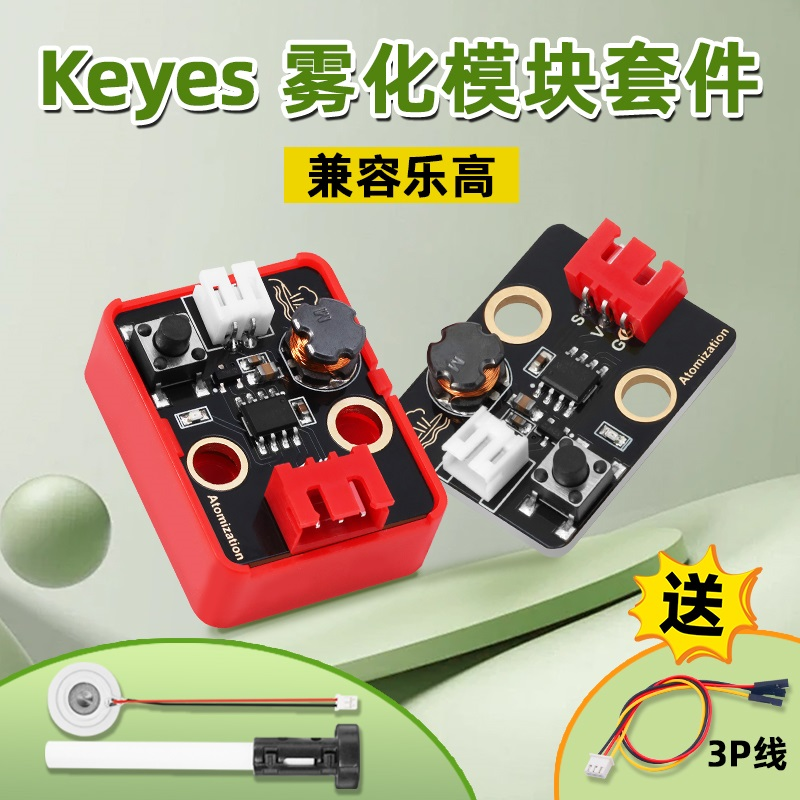
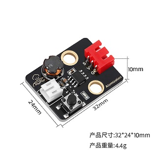
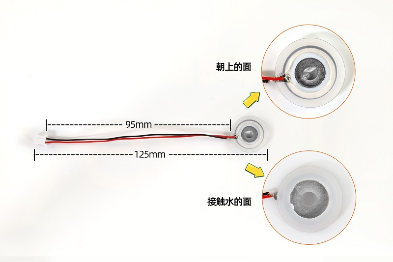
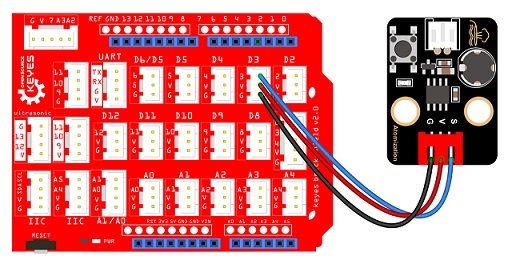
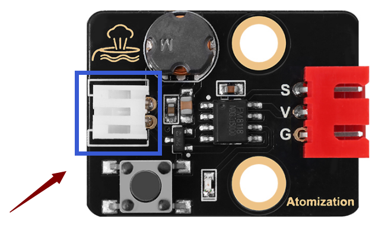
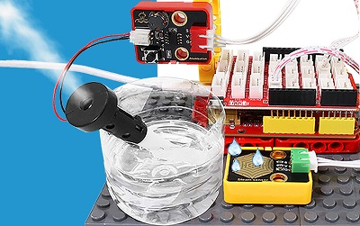
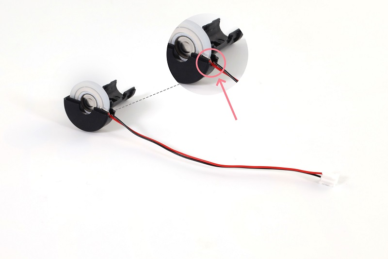
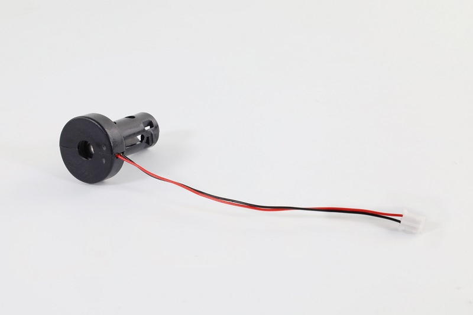
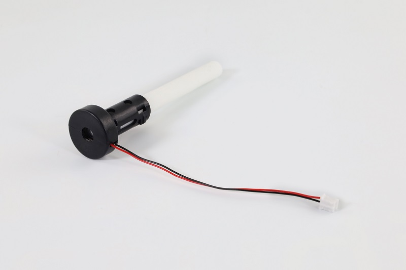
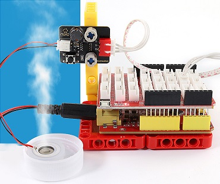

# keyes 雾化模块 黑色 环保



## 资料下载

[code](./code.zip)


## 概述

雾化模块，由驱动模块和雾化片组成，主要作用是把水雾化加湿。可用单片机控制或手动按键控制。V 接 3~5V 电压输入，G 接 GND，S 是信号引脚。

工作原理：加湿器雾化模块通常使用超声波技术来产生水雾。它包含一个压电陶瓷片，当通过其施加高频电压时，它开始振动。振动引起水的表面形成小水滴并其击散形成微细的水雾。

水雾质量：加湿器雾化模块可以有效地将水分转化为微小的水粒子，通常在1至5微米的范围内。这种微细的水雾更容易在空气中蒸发和扩散，从而提供更有效的加湿效果。

**注意：**

**1、开启开关后雾化片要放水里，长时间放空气中，雾化片会发烫烧毁。**

**2、将雾化片轻放于水面之上，若将整个雾化片放入水中，会导致雾化片无法成功产生水雾。**


## 规格参数

- 工作电压：3.3V/5V
- 安装孔参数：孔径4.8mm，孔距16mm
- 模块尺寸：长31mm，宽23mm，高8mm
- 重量：4.5 g
- 工作温度范围：-25°C 到 +60°C
- 模块接口：3pin 2.54间距 弯排针
- 雾化片接口：PH2.0 母端
- 实现功能：用于将水转化为微细的水雾，并将其释放到空气中


## 尺寸图

### 模块尺寸图




### 雾化片尺寸图




## 接线图




雾化片接到模块的PH2.0 母端，下图所示位置。




## 雾化模块使用说明

此雾化模块有两种控制模式：按键自动控制和单片机编程。

**按键自动控制：** 按下按键，开启雾化模块。再次按下按键，关闭雾化模块。

**单片机编程：** 模拟按键按下。按键在正常状态下输出高电平，当按键按下时，输出低电平；松开按键，再次输出高电平。

所以，使用单片机编程时，仅需输入一个短暂的低电平到雾化模块，即可模拟按键被按下。接着输入高电平，通过控制高电平的时间来控制雾化模块开启或暂停的时间。


## 实验代码

```c
int atomization = 3;  //定义雾化模块连接引脚
void setup() {
  pinMode(atomization, OUTPUT);//设置引脚为输出模式
  digitalWrite(atomization, HIGH);//初始化引脚为高电平   
}

void loop() {
  //开启雾化模块，相当于按键按下
  digitalWrite(atomization, LOW);   
  delay(200);  
  digitalWrite(atomization, HIGH); 
  delay(3000); 
  //关闭雾化模块，按键再次按下
  digitalWrite(atomization, LOW); 
  delay(200); 
  digitalWrite(atomization, HIGH);   
  delay(1000);
}
```


## 代码说明

| 代码                            | 说明                                                       |
| ------------------------------- | ---------------------------------------------------------- |
| pinMode(atomization, OUTPUT)    | 将引脚设置为输出模式。                                     |
| digitalWrite(atomization, HIGH) | 设置引脚的输出电压为高\低电平。HIGH为高电平，LOW为低电平。 |
| delay(1000)                     | 将程序的执行暂停一段时间,也就是延时。单位是毫秒。          |


## 实验结果

### 雾化片

**注意：雾化片正面朝上，雾化片轻置于水面之上，正面不要被水覆盖。**


将示例代码上传到主板，上传成功后，按照接线图接好线，把雾化片放水面，雾化片开始工作，按照喷雾3秒，停1秒的规律循环交替。




### 加湿棉棒

安装加湿棉棒步骤：

将雾化片安装至塑料支架内部。注意雾化片的方向，雾化片的连接线放置在塑料支架凹槽处。




将另一边塑料支架装上。




将棉棒插入塑料支架中间。



安装完成。

**注意：由于棉棒吸水需要时间，为了避免模块上电后棉棒未吸满水导致雾化片烧坏，请先将棉棒插入水中，待吸满水后再上传代码进行实验。**


按照接线图接好线，把棉棒插入水里，等待2~3分钟棉棒吸满水后，将示例代码上传到主板，上传成功后雾化片开始工作，按照喷雾3秒，停1秒的规律循环交替。



请注意，由于棉棒吸水的速率较慢，长时间工作后可能会导致雾化片每工作一段时间就会停止2~3秒，待棉棒吸水充足后又继续工作。